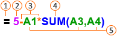
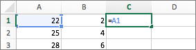
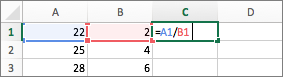
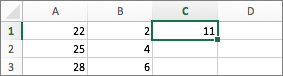
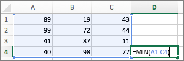
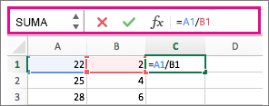
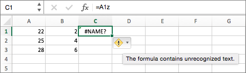
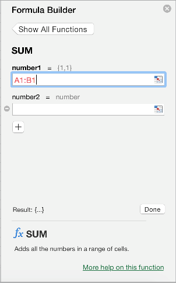
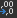

# Ingresar datos a Excel

## Índice
- [Ingresar datos a Excel](#ingresar-datos-a-excel)
  - [Índice](#índice)
  - [Introducción](#introducción)
    - [Escribir una fórmula que hace referencia a valores de otras celdas](#escribir-una-fórmula-que-hace-referencia-a-valores-de-otras-celdas)
    - [Escribir una fórmula que contiene una función](#escribir-una-fórmula-que-contiene-una-función)
    - [Sugerencias](#sugerencias)
  - [Actividad de clase](#actividad-de-clase)
  - [Bibliografía](#bibliografía)

## Introducción

Excel pone a disposición varias opciones para introducir datos manualmente. Puedes escribir datos en una celda, en varias celdas al mismo tiempo o en más de una hoja de cálculo a la vez. Los datos que introduzca pueden ser números, texto, fechas u horas. Puede dar formato a estos datos de varias maneras. Además, puede ajustar varias opciones de configuración para que le resulte más fácil introducirlos.

Del mismo modo puedes agregar fórmulas que son las ecuaciones que realizan cálculos de los valores en la hoja. Todas las fórmulas comienzan con un signo igual (=). Puede crear una fórmula sencilla usando constante cálculo y operador. Por ejemplo, la fórmula `=5+2*3`, multiplica dos números y después, agrega un número al resultado.

Cuando quieras hacer referencia a variables en lugar de constantes, puede usar valores de celda, por ejemplo, `=A1+A2`. Si trabaja con columnas largas de datos o datos que se encuentran en diferentes partes de una hoja o en otra hoja, puede usar un intervalo (por ejemplo, `=SUMA(A1:A100)/SUMA(B1:B100)`,que representa la división de la suma de los primeros cien números de la columna `A` por la suma de esos números en la columna `B`. Cuando la fórmula hace referencia a otras celdas, siempre que cambie los datos de cualquiera de las celdas Excel recalculará los resultados automáticamente.

> **NOTA**:También puede crear una fórmula usando una función, una fórmula predefinida que simplifica la introducción los cálculos.

1. signos iguales inician todas las fórmulas.

2. constantes, como números o valores de texto, se pueden introducir directamente en una fórmula.

3. operadores especifican el tipo de cálculo que realiza la fórmula. Por ejemplo, el operador `^` (símbolo de intercalación) eleva un número a una potencia y el operador `*` (asterisco) multiplica los números.

4. funciones son fórmulas predefinidas que se pueden usar solos o como parte de una fórmula más larga. Cada función tiene una sintaxis de argumento específica.

5. celda le permiten hacer referencia Excel una celda, en lugar del valor específico dentro de la celda para que el contenido de la celda pueda cambiar sin la función que hace referencia a la celda que tiene que cambiar.

### Escribir una fórmula que hace referencia a valores de otras celdas

1. En una hoja que contiene columnas de números, haga clic en la celda donde desea que aparezcan los resultados de la fórmula.

2. Escriba un signo igual `=`

3. Haga clic en la primera celda que desee incluir en el cálculo.

    

4. Escriba un operador. Un operador es el tipo de cálculo que la fórmula realiza. Por ejemplo, el operador `*` (asterisco) multiplica números. En este ejemplo, utilice la `/` (barra diagonal) para dividir. En este punto la fórmula debe tener el siguiente aspecto:

    

5. Haga clic en la celda siguiente que desea incluir en el cálculo. Ahora la fórmula debe tener el siguiente aspecto:

    

6. Presione INTRO

    El resultado del cálculo aparece en la celda.

    

> **Sugerencia**: Para aplicar una fórmula en las siguientes celdas hacia abajo de la columna, haga doble clic en la  primera celda que contiene la fórmula.

### Escribir una fórmula que contiene una función

1. En una hoja que contiene un rango de números, haga clic en la celda vacía donde desee que aparezcan los resultados de la fórmula.

2. Escriba un signo igual y una función, por ejemplo `=MIN`. `MIN` encuentra el númeromás pequeño de un rango de celdas.

3. Escriba un paréntesis de apertura, seleccione el rango de celdas que desea incluir en la fórmula y después, escriba un paréntesis de cierre.

    

4. Presione INTRO

    En nuestro ejemplo, la función `MIN` devuelve `11`, el número más pequeño en las celdas `A1` a `C4`.

### Sugerencias

Cuando escriba una fórmula en una celda también aparecerá en la barra de fórmulas.

Usar los métodos abreviados en la barra de fórmulas para ayudarle a crear fórmulas:

- Seleccione esta opción para  comprobar la fórmula. Si no hay errores, la celda mostrará el resultado de la fórmula. Si hay errores, verá . Desplace el puntero sobre él para obtener una explicación del problema, o bien, seleccione la lista desplegable para obtener más ayuda.

- Seleccione esta opción para  volver a la fórmula anterior.

- 

- Para seleccionar una función, utilice la lista de funciones.

    

    Cuando se selecciona una función, se abre el Generador de fórmulas, con información adicional sobre la función.

    

## Actividad de clase

De acuerdo a la introducción, en Excel podemos ingresar datos, fórmulas y funciones como tipos básicos. Además de poder realizar gráficas, macros, etc.

Esta actividad muestra los pasos realizados en clase y para replicarla, ejecuta los siguientes pasos:

1. Abrir Microsoft Excel.
2. Crear un nuevo archivo de Excel en blanco.
3. Ubicarse en la celda `A3` y escribir la cantidad de `1500`, presione INTRO.
4. Ahora, en la celda `B1`, escribir el texto `Informática II`, presione INTRO.
5. Ingresamos la fórmula `=B1` en la celda `C2`, presione INTRO. _(Se muestra el valor de B1, 'Informática II')_
6. En la celda `C3` ingresar la fórmula `=A3-1000`, presione INTRO. _(Se muestra '500', que es la resta de '1500-1000')_
7. Ingresamos los siguientes datos:

   |Celda|Valor|
   |-|-|
   |`D1`|`50`|
   |`D2`|`100`|
   |`D3`|`20`|

8. El objetivo de los datos, es obtener el promedio de los `n` números, sabiendo que la fórmula matemática es:

    $\overline{x}={{a_1+a_2+a_3+...+a_n}\over n}$

    En la celda `D4`, intrudicir cualquiera de las fórmulas siguientes que tienen el mismo efecto:
   - `=promedio(D1,D2,D3)`: Esta función toma los valores de las celdas indicadas y las promedia.
   - `=promedio(D1:D3)`: Tiene el mismo efecto que la fórmula anterior, pero es más eficiente, ya que sólo se indica la primera celda y la última del rango apromediar _(Es más eficiente al escribirla)_.
   - `=(D1+D2+D3)/3`: Esta es la manera de ingresar la fórmula como se conoce comúnmente, donde metemos los valores y dividimos entre la cantidad de elementos.

    Después de ingresar la función o fórmula, presione INTRO.

9. Finalmente se muestra el promedio que es `56.6666667`.
10. Para que el resultado no muestre tantos decimales, seleccione la celda `D4` y hacer clic en _**Inicio**_ > _**Número**_ >  (Hacer tantos clic como sea posible hasta obtener `56.67`).
11. Finalmente para validar un campo por su contenido, se selecciona la celda `B1`, después _**Inicio**_ > _**Estilos**_ > _**Formato condicional**_ > _Reglas para resaltar celdas_ > _Texto que contiene_.
12. En el campo que se muestra en la nueva ventana debe escribir `Info` y en las opciones del segundo campo, seleccionar `Relleno verde con texto verde oscuro`.
13. Hacer clic en Aceptar. _(Inmediatamente cambiaará el formato de la celda)_
14. Cambiar el nombre de la hoja de cálculo con su nombre.
15. Guardar el archivo con el nombre `2_1_actividad_nombre-completo`.
16. Fin de la actividad.

## Bibliografía

- [Introducir datos manualmente en celdas de hojas de cálculo](https://support.microsoft.com/es-es/office/introducir-datos-manualmente-en-celdas-de-hojas-de-c%C3%A1lculo-c798181d-d75a-41b1-92ad-6c0800f80038#:~:text=Introducir%20texto%20o%20un%20n%C3%BAmero,introducir%20un%20salto%20de%20l%C3%ADnea.)
