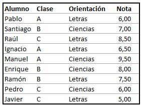

# Uso de las fórmulas más utilizadas en Excel

## Índice

- [Uso de las fórmulas más utilizadas en Excel](#uso-de-las-fórmulas-más-utilizadas-en-excel)
  - [Índice](#índice)
  - [Top fórmulas más usadas](#top-fórmulas-más-usadas)
  - [Actividad para enviar](#actividad-para-enviar)

## Top fórmulas más usadas

A Continuación se muestran las fórmulas más utilizadas en Microsoft Excel:

|Fórmula|Descripción|Ejemplo de estructura|
|-|-|-|
|`=SUMA()`|Esta es una fórmula elemental que no puedes no conocer. Si no la has usado hasta ahora creo que ya puedes darte por satisfecho porque verás cómo te ahorra tiempo.  SUMA te permite, tal como su nombre lo indica, sumar un grupo de celdas, o incluso filas y columnas enteras!|`=SUMA(A1:A10)`, `=SUMA(A:A)`, `=SUMA(A1:Z10)`|
|`=CONTAR()`|Esta fórmula te permite contar la cantidad de celdas en una selección que tienen números. Las celdas vacías o con texto son ignoradas. Muchas veces tenemos planillas con datos incompletos y se necesita contar solamente los datos y no el total de celdas. En esos casos sirve muchísimo!|`=CONTAR(A1:B10)`, `=CONTAR(A:A)`|
|`=CONTARA()`|Similar a CONTAR pero cuenta no solamente las celdas con números sino todas las celdas no vacías (es decir, pueden contener también texto).|`=CONTARA()`|
|`=CONTAR.SI()`|Esta fórmula permite contar elementos que cumplen un cierto criterio. Este criterio puede ser por ejemplo que las celdas sean iguales a un cierto valor, o que sean mayor/menos que un valor, o que sean iguales que algún texto, etc. Veamos algunos ejemplos:|Cuenta la cantidad de celdas con un número mayor que cero: `=CONTAR.SI("A1:B10", ">0")` Cuenta la cantidad de celdas con la palabra "azul": `=CONTAR.SI("A1:B10", "azul")`|
|`=SI()`|Esta fórmula te permite tener un valor u otro en la celda dependiendo de una cierta condición. Las condiciones son similares a lo que se puede hacer con la fórmula CONTAR.SI. Por ejemplo, podemos tener las notas de un alumno en un listado, y si el promedio es mayor o menor que un cierto límite, podemos escribir "aprobado" o "reprobado" para el alumno:|`=SI(A1 > 0, "VALOR POSITIVO", "VALOR NEGATIVO")`|
|`=BUSCARV()`|Permite buscar un valor específico en la primera columna de una tabla, y retornar el valor en la misma fila para otra columna diferente. Esto suena algo abstracto así que lo voy a ilustrar con un ejemplo. Tenemos un listado con alumnos y sus notas en cada evaluación. Queremos obtener la nota que el alumno "PEDRO" obtuvo en la tercera evaluación, entonces utilizamos la siguiente fórmula:|`=BUSCARV("PEDRO", A1:Z100, 10, FALSO)` _Notar que el "FALSO" se ingresa para indicar que queremos una búsqueda exacta, es decir sólo queremos el valor para la entrada con índice PEDRO. Notas también que la primera columna que se cuenta es la primera, por eso la que buscamos (la tercera evaluación) es la columna número 4._
|`=BUSCARH()`|Similar a BUSCARV pero utilizando la misma analogía en sentido horizontal. Es decir buscamos un valor en la primera celda de la tabla, y luego obtenemos el valor de la celda ubicada en la misma columna que nuestro índice, con el número de fila ingresado: Ejemplo, tenemos las ventas de distintos productos, y queremos saber el total que se vendió para el producto "jabón" en el cuarto mes:|`=BUSCARH("JABON", A1:C10, 4, FALSO)` _El uso de "FALSO" es igual al caso anterior. La cuenta de las filas parte desde la fila con los encabezados, por lo que el tercer mes corresponde al índice 4._
|`=SUMAR.SI()`, `=PROMEDIO.SI()`|Estas funciones nos permiten realizar una suma o un promedio solamente para los valore que cumplen una condición. Las condiciones que se pueden ingresar siguen el mismo formato que las condiciones utilizadas en CONTAR.SI y el SI.|`=SUMAR.SI(A1:Z1, ">0")`|
|`=CONCATENAR()`|Esta fórmula nos permite unir dos o más cadenas de texto en una sola celda. Por ejemplo tenemos una columna "nombres" y otra "apellidos", y queremos crear una tercera columna llamada "nombre completo". En este caso queremos unir el nombre con el apellido, y además poner un espacio entremedio. Se haría de la siguiente manera:|`=CONCATENAR("A1", " ", "B1")`|
|`=ALEATORIO.ENTRE()`|Muchas veces se necesita llenar una tabla con números distintos de manera rápida, solamente para mostrar algo y nos pasamos un buen rato escribiendo número uno a uno y tratando de que sean distintos entre sí. Bueno, ALEATORIO.ENTRE nos permitegenerar un número aleatorio en un rango que nosotros especificamos:|`=ALEATORIO.ENTRE(100, 1000)`|

## Actividad para enviar

Dada la siguiente tabla que relaciona los alumnos de una clase con los siguientes parámetros:

- Nombre
- Clase
- Orientación académica
- Nota final

Se pide:

1. Hallar la nota media de los alumnos.

   Usa `=PROMEDIO(E4:E12)` en `C15`

2. Hallar la nota máxima obtenida.

   Usa `=MAX(E4:E12)` en `C16`

3. Hallar la nota más baja obtenida.

   Usa `=MIN(E4:E12)` en `C17`

4. Contar el número de alumnos participantes.

   Usa `=CONTARA(B4:B12)` en `C18`

5. Hallar la nota media para cada orientación académica.

   Usa `=PROMEDIO.SI(D4:D12,B21,E4:E12)` en `C21`

   **En `C22` utiliza la misma fórmula pero ahora para obtener el promedio por la materia _Ciencias_**

6. Hallar la nota media para cada clase.

   Usa `=PROMEDIO.SI(C4:C12,B25,E4:E12)` en `C25`

   **En `C26` y `C27` utiliza la misma fórmula pero ahora para obtener el promedio por la clase _B_ y _C_**

7. Hallar la clase y nota de un alumno (por ejemplo Raúl).

   Usa `=BUSCARV(G16,B4:E12,2,0)` en `H16`

8. Contar el número de personas que han sacado una nota igual o superior a 7.

   Usa `=CONTAR.SI(E4:E12,">=7")` en `G21`

Puedes descargar al archivo [activity.xlsx](./activity.xlsx) para realizar el ejercicio.

> Cambiar el nombre de la hoja de cálculo con su nombre.
> Guardar el archivo con el nombre `2_2_actividad_nombre-completo`.
