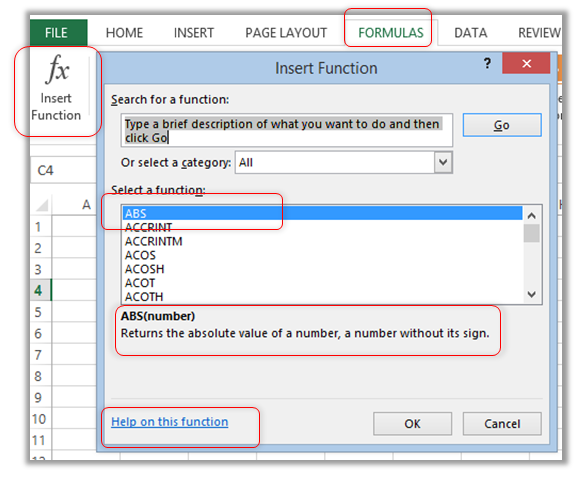
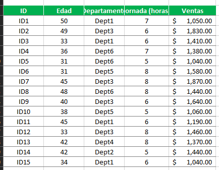

# Anatomía de las funciones en Excel

## Índice

- [Anatomía de las funciones en Excel](#anatomía-de-las-funciones-en-excel)
  - [Índice](#índice)
  - [Introducción](#introducción)
  - [Partes de las funciones de Excel](#partes-de-las-funciones-de-excel)
  - [Sintaxis de las funciones de Excel](#sintaxis-de-las-funciones-de-excel)
  - [Actividad de clase](#actividad-de-clase)

## Introducción

Hay cientos, si no miles, de sitios explicando como usar formulas en Excel. Hasta Microsoft las tiene, aunque en Español deben de ser menor cantidad que en ingles.

A menos que no hayas asistito a clases, ya sabrás que `A1+A2` es la fórmula para sumar los contenidos de cada una de esas celdas. Para el resto del mundo (el 99%), esto es fácil de entender. O sea que ya sabemos eso. No hay nada nuevo ahí. Pero cuando pongo lo siguiente, se reduce a 80%.

`=SUM(A1:A5)`

Aun así, la mayoría también ya sabe que esa es una función que suma las celdas `A1` hasta `A5`. Hacemos esto porque es más fácil que escribir `=A1+A2+A3+A4+A5`. Y si tuvieramos cientos de celdas que sumar? `A1:A100` es mucho más facil, verdad?

Pues las fórmulas consisten en una palabra clave y sus argumentos entre parentesis. En el ejemplo de arriba, _SUM_ es la clave y _A1:A5_ es el argumento. La clave dice _**que hacer**_, el argumento es _**el material con que hacerlo**_. Es como decir: _ContruyeMesa(madera)_ o _ContruyeMesa(concreto)_ o _ContruyeMesa(concreto y madera)_ o _ContruyeMesa(metal)_, etc.

Excel ofrece cientos de formulas nativas llamadas funciones. Pero también ofrece un mundo de documentación en como usarlas, por si no sabes cómo o por si se te olvidó, todo esto está en un ayudante virtual que se llama Formula Wizard (es como el mago). Busca al mago en _Formulas_ > _Biblioteca de funciones_ > _Insertar función_ (Recuerda como navegar la cinta de opciones de excel).

## Partes de las funciones de Excel

Ahora que ya sabemos qué son las funciones y cómo funcionan podemos especificar las partes que componen esta operación matemática.

- _Signo =_. Toda fórmula y funciones de Excel comienza con el símbolo =, de este modo indicamos al programa que va a comenzar una ecuación matemática.
- _Nombre de la función_. El siguiente paso es redactar el nombre que recibe cada función de Excel, podemos consultar la base de datos  de Office para conocer todas las que hay. Otro opción es utilizar el asistente de Excel, cuando estamos escribiendo la función de Excel aparece un desplegable con coincidencias de palabra, incluye el nombre de la función y una pequeña descripción para conocer qué operaciones matemáticas realiza.
- _Paréntesis_. Una vez introducimos el nombre de la función abrimos paréntesis e introducimos los valores de la ecuación, una vez esté completada es importante cerrar el paréntesis.
Argumentos. Se trata de los datos que se necesitan para realizar el cálculo, en este caso es necesario conocer las propiedades de cada función y qué argumentos tiene.  Los argumentos utilizan referencias de celdas, valores numéricos o de texto, así como operadores matemáticos (+,-,*,/). Se separan los argumentos con el símbolo de punto y coma (;).

## Sintaxis de las funciones de Excel

Una de las partes más importantes de las funciones de Excel es la sintaxis que la forma, hace referencia a cómo se escriben los argumentos de la función correctamente.

La sintaxis de una función determina el orden de los argumentos _=nombre(argumento; argumento; argumento)_.

Si se conoce la sintaxis de la función de Excel podemos introducirla de manera manual, si no se conoce, es recomendable introducir las funciones con el asistente de Excel. De este modo nos aseguramos que los argumentos están correctamente definidos.

Para entender mejor qué son las sintaxis de las funciones vamos a explicar varios ejemplos:

La sintaxis de la función SUMA devuelve el total de una operación matemática con el operador sumatorio, sería así: `=SUMA(número, número2)` y su traducción sería `=SUMA(1+3)`.

La sintaxis de la función BUSCARV busca un valor dentro de una columna y devuelve el valor de otra columna de referencia, en este caso se formula así `=BUSCARV(valor_buscado, rango, valor_regresado, [ordenado])`, que se traduce en `=BUSCARV("Excel", A1:B9, 4)`.

La sintaxis de la función SI evalúa una condición y devuelve el valor que coincide, se formula así `=SI(condición, (si_verdaddero), (si_falso))`.

## Actividad de clase

En este ejercicio de Excel de funciones básicas vamos a practicar el uso de las siguientes funciones:

SUMAR: nos permite hacer una suma de varias celdas.

CONTAR: nos permite contar el número de celdas con números de un rango.

PROMEDIO: nos permite hacer la media aritmética de un conjunto de celdas.

CONTAR.SI: nos permite contar el número de celdas que cumplen una condición.

PROMEDIO.SI: nos permite hacer la media de un conjunto de celdas que cumplen una condición.

SUMAR.SI: nos permite hacer una suma de valores dependiendo del valor de las celdas. Es decir, una suma condicional.

La tabla de datos sobre la que vamos a trabajar es la siguiente:

A través de esta tabla queremos obtener los siguientes resultados:

1. **Número de comerciales de la lista**. Utiliza la función CONTAR.
2. **Edad media de los comerciales**. Utiliza la función PROMEDIO.
3. **Jornada media de los empleados**. Utiliza la función PROMEDIO.
4. **Suma de las ventas realizadas**. Utiliza la función SUMA.
5. **Número de comerciales en el departamento 1 (Dept1)**. Utiliza la función CONTAR.SI.
6. **Media de edad de los comerciales del departamento 2 (Dept2)**. Utiliza la función PROMEDIO.SI.
7. **Suma de las ventas de los empleados del departament 3 (Dept3)**. Utiliza la función SUMA.SI.
8. **Suma de las ventas de los empleados del Departamento 4 y 5 (Dept4 y Dept5)**. Utiliza la función SUMA.SI dos veces.
9. **Media de las ventas de los empleados mayores de 40 años**. Utiliza la función PROMEDIO.SI.
10. **Media de la jornada de los empleados que venden más de $1.500**. Utiliza la función PROMEDIO.SI.
11. **Suma de las ventas mayores de $1.200**. Utiliza la función SUMAR.SI.

Puedes descargar al archivo [ejercicio-de-Excel-con-funciones-solved](./ejercicio-de-Excel-con-funciones-solved.xlsx) para realizar el ejercicio.

> Cambiar el nombre de la hoja de cálculo con su nombre. 
> Guardar el archivo con el nombre `2_3_actividad_nombre-completo`.
