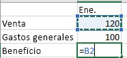
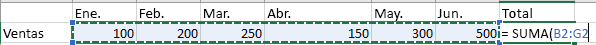

# Guía 2da Unidad

## Índice

- [Guía 2da Unidad](#guía-2da-unidad)
  - [Índice](#índice)
  - [Rangos de celdas](#rangos-de-celdas)
  - [Crear una fórmulas](#crear-una-fórmulas)
    - [Ver una fórmula](#ver-una-fórmula)
    - [Escribir una fórmula que contiene una función integrada](#escribir-una-fórmula-que-contiene-una-función-integrada)
    - [Análisis detallado de las fórmulas](#análisis-detallado-de-las-fórmulas)
      - [Las partes de una fórmula de Excel](#las-partes-de-una-fórmula-de-excel)
      - [Usar constantes en fórmulas de Excel](#usar-constantes-en-fórmulas-de-excel)
      - [Usar referencias en fórmulas de Excel](#usar-referencias-en-fórmulas-de-excel)
        - [Estilo de referencia A1](#estilo-de-referencia-a1)
    - [Funciones condicionales](#funciones-condicionales)
      - [Criterio vs. Condición](#criterio-vs-condición)
        - [Operadores de comparación](#operadores-de-comparación)
  - [Top funciones más usadas](#top-funciones-más-usadas)
  - [Resumen de Errores en Excel](#resumen-de-errores-en-excel)

## Rangos de celdas

Un rango en Excel es un conjunto de celdas contiguas que se pueden seleccionar para realizar una operación con todas ellas. Además, **su dirección está dada por la celda superior izquierda seguido de dos puntos y la celda inferior derecha**.

Por ejemplo, podemos decir que el rango `A1:C2` está conformado por las celdas `A1`, `B1`, `C1`, `A2`, `B2` y `C2`. A la hora de interpretarlo podemos hacer referencia a las celdas que van desde `A1` hasta la `C2` que abarcan `6` celdas en total.

Además, un rango de celdas puede estar compuesto por una sola celda o "X" cantidad de celdas, lo que quiere decir esto, es que una celda por sí misma ya representa un rango en Excel.

En general, si trabajas con celdas trabajas con rangos y básicamente los rangos son utilizados para casi todo lo que se haga en Excel. Por ejemplo un rango nos sirve para:

:zap: Darle formato a un conjunto de celdas, si seleccionamos el rango podemos hacer estas configuraciones.

:bar_chart: Utilizar los datos de un rango de celdas para graficar o crear un gráfico.

:bookmark_tabs: A través de un rango de celdas podemos crear o formar una tabla.

:clipboard: Una Tabla Pivote genera reportes a partir de los datos que tengamos en un rango de celdas.

:pencil2: Crear o realizar fórmulas o funciones con los datos contenidos en un rango de celdas.

Estas son simplemente unas cuantas opciones de lo que podemos hacer con un rango en Excel de muchas opciones más. Básicamente un rango sirve para casi todo lo que hagamos en Excel, de hecho, siempre que trabajes en la hoja de cálculo de Excel, estarás trabajando con un rango.

## Crear una fórmulas

1. Seleccione una celda.

2. Escriba el signo igual `=`.

    > Nota: Las fórmulas de Excel siempre comienzan con el signo igual `=`.

3. Seleccione una celda o escriba su dirección en la celda seleccionada.

    

4. Escriba un operador. Por ejemplo, “-” para restar.

5. Seleccione la celda siguiente o escriba su dirección en la celda seleccionada.

    

6. Presione Entrar. El resultado del cálculo se mostrará en la celda que contenga la fórmula.

### Ver una fórmula

1. Al escribir una fórmula en una celda, también se muestra en la barra de fórmulas.

    

2. Para ver una fórmula, seleccione una celda y esta se mostrará en la barra de fórmulas.

    

### Escribir una fórmula que contiene una función integrada

1. Seleccione una celda vacía.

2. Escriba un signo igual `=` y luego escriba una función. Por ejemplo, `=SUMA` para obtener las ventas totales.

3. Escriba un paréntesis de apertura: `(`.

4. Seleccione el rango de celdas y, después, escriba un paréntesis de cierre: `)`.

    

5. Presione Entrar para obtener el resultado.

### Análisis detallado de las fórmulas

Explorar las secciones individuales siguientes para obtener más información sobre elementos de fórmula específicos.

#### Las partes de una fórmula de Excel

Una fórmula también puede contener algunos o todos los elementos siguientes: funciones, referencias, operadores y constantes.

Partes de una fórmula

1. **Funciones**: la función `PI()` devuelve el valor de $Pi: 3,142...$.

2. **Referencias**: `A2` devuelve el valor de la calda A2.

3. **Constantes**: números o valores de texto escritos directamente en una fórmula como, por ejemplo, $2$.

4. **Operadores**: el operador `^` (acento circunflejo) eleva un número a una potencia y el operador `*` (asterisco) multiplica números.

#### Usar constantes en fórmulas de Excel

Una constante es un valor que no se calcula, sino que permanece igual siempre. Por ejemplo, la fecha `9-10-2008`, el número `210` y el texto `"Ganancias trimestrales"` son constantes. Una expresión o un valor obtenido como resultado de una expresión, no son constantes. Si usa constantes en la fórmula en vez de referencias a celdas (por ejemplo, `=(30+70+110)/3` para obtener un promedio), el resultado solo cambia si modifica la fórmula. En general, es mejor insertar constantes en celdas individuales donde se puedan cambiar fácilmente si fuera necesario y luego hacer referencia a esas celdas en las fórmulas.

#### Usar referencias en fórmulas de Excel

Una referencia identifica una celda o un rango de celdas en una hoja de cálculo e indica a Excel dónde debe buscar los valores o los datos que desea usar en una fórmula. Las referencias permiten usar datos de distintas partes de una hoja de cálculo en una fórmula, o bien usar el valor de una celda en varias fórmulas. También puede hacerse referencia a las celdas de otras hojas en el mismo libro y de otros libros. Las referencias a celdas de otros libros se denominan vínculos o referencias externas.

##### Estilo de referencia A1

De forma predeterminada, Excel usa el estilo de referencia A1, que se refiere a las columnas con letras (de `A` a `XFD`, para un total de $16,384$ columnas) y a las filas con números (del `1` al `1 048 576`). Estas letras y números se denominan encabezados de fila y de columna. Para hacer referencia a una celda, escriba la letra de la columna seguida del número de fila. Por ejemplo, `B2` hace referencia a la celda en la intersección de la columna `B` y la fila `2`.

|Para hacer referencia a|Usar|
|-|-|
|La celda de la columna A y la fila 10|A10|
|El rango de celdas de la columna A y de las filas 10 a 20|A10:A20|
|El rango de celdas de la fila 15 y de las columnas B a E|B15:E15|
|Todas las celdas de la fila 5|5:5|
|Todas las celdas de las filas 5 a 10|5:10|
|Todas las celdas de la columna H|H:H|
|Todas las celdas desde la columna H hasta la J|H:J|
|El rango de celdas de las columnas A a E y de las filas 10 a 20|A10:E20|

### Funciones condicionales

Las función condicional en Excel es aquella que permite la realización de una acción, siempre que se cumpla con una **condición** o un **criterio** que deberás determinar. Todas las fórmulas condicionales en Excel tienen como base la función SI, que se trata de la función condicional per se.

La sintaxis del conjunto de funciones condicionales en Excel se define de la siguiente forma: `=CONTAR.SI(rango, criterio)`.

#### Criterio vs. Condición

En Excel, hay una diferencia entre un criterio y una condición. Una condición es cuando hay un operador (`=`, `<`, `>=`, etc.) que tiene un valor en cualquier lado (`A2 <= 3`). En cambio, un criterio es cuando hay un operador y solo un valor (a la derecha del operador) con todo el criterio entre comillas (`"=15"`).

##### Operadores de comparación

|Operador de comparación|Significado|Ejemplo|
|-|-|-|
|= (signo igual)|Igual a|A1=B1|
|> (signo mayor que)|Mayor que|A1>B1|
|< (signo menor que)|Menor que|A1<B1|
|>= (signo mayor o igual que)|Mayor o igual que|A1>=B1|
|<= (signo menor o igual que)|Menor o igual que|A1<=B1|
|<> (signo distinto de)|No es igual a|A1<>B1|

## Top funciones más usadas

A Continuación se muestran las funciones más utilizadas en Microsoft Excel:

|Fórmula|Descripción|Ejemplo de estructura|
|-|-|-|
|`=SUMA()`|Esta es una fórmula elemental que no puedes no conocer. Si no la has usado hasta ahora creo que ya puedes darte por satisfecho porque verás cómo te ahorra tiempo.  SUMA te permite, tal como su nombre lo indica, sumar un grupo de celdas, o incluso filas y columnas enteras!|`=SUMA(A1:A10)`, `=SUMA(A:A)`, `=SUMA(A1:Z10)`|
|`=CONTAR()`|Esta fórmula te permite contar la cantidad de celdas en una selección que tienen números. Las celdas vacías o con texto son ignoradas. Muchas veces tenemos planillas con datos incompletos y se necesita contar solamente los datos y no el total de celdas. En esos casos sirve muchísimo!|`=CONTAR(A1:B10)`, `=CONTAR(A:A)`|
|`=CONTARA()`|Similar a CONTAR pero cuenta no solamente las celdas con números sino todas las celdas no vacías (es decir, pueden contener también texto).|`=CONTARA()`|
|`=CONTAR.SI()`|Esta fórmula permite contar elementos que cumplen un cierto criterio. Este criterio puede ser por ejemplo que las celdas sean iguales a un cierto valor, o que sean mayor/menos que un valor, o que sean iguales que algún texto, etc. Veamos algunos ejemplos:|Cuenta la cantidad de celdas con un número mayor que cero: `=CONTAR.SI("A1:B10", ">0")` Cuenta la cantidad de celdas con la palabra "azul": `=CONTAR.SI("A1:B10", "azul")`|
|`=SI()`|Esta fórmula te permite tener un valor u otro en la celda dependiendo de una cierta condición. Las condiciones son similares a lo que se puede hacer con la fórmula CONTAR.SI. Por ejemplo, podemos tener las notas de un alumno en un listado, y si el promedio es mayor o menor que un cierto límite, podemos escribir "aprobado" o "reprobado" para el alumno:|`=SI(A1 > 0, "VALOR POSITIVO", "VALOR NEGATIVO")`|
|`=BUSCARV()`|Permite buscar un valor específico en la primera columna de una tabla, y retornar el valor en la misma fila para otra columna diferente. Esto suena algo abstracto así que lo voy a ilustrar con un ejemplo. Tenemos un listado con alumnos y sus notas en cada evaluación. Queremos obtener la nota que el alumno "PEDRO" obtuvo en la tercera evaluación, entonces utilizamos la siguiente fórmula:|`=BUSCARV("PEDRO", A1:Z100, 10, FALSO)` _Notar que el "FALSO" se ingresa para indicar que queremos una búsqueda exacta, es decir sólo queremos el valor para la entrada con índice PEDRO. Notas también que la primera columna que se cuenta es la primera, por eso la que buscamos (la tercera evaluación) es la columna número 4._
|`=BUSCARH()`|Similar a BUSCARV pero utilizando la misma analogía en sentido horizontal. Es decir buscamos un valor en la primera celda de la tabla, y luego obtenemos el valor de la celda ubicada en la misma columna que nuestro índice, con el número de fila ingresado: Ejemplo, tenemos las ventas de distintos productos, y queremos saber el total que se vendió para el producto "jabón" en el cuarto mes:|`=BUSCARH("JABON", A1:C10, 4, FALSO)` _El uso de "FALSO" es igual al caso anterior. La cuenta de las filas parte desde la fila con los encabezados, por lo que el tercer mes corresponde al índice 4._
|`=SUMAR.SI()`, `=PROMEDIO.SI()`|Estas funciones nos permiten realizar una suma o un promedio solamente para los valore que cumplen una condición. Las condiciones que se pueden ingresar siguen el mismo formato que las condiciones utilizadas en CONTAR.SI y el SI.|`=SUMAR.SI(A1:Z1, ">0")`|
|`=CONCATENAR()`|Esta fórmula nos permite unir dos o más cadenas de texto en una sola celda. Por ejemplo tenemos una columna "nombres" y otra "apellidos", y queremos crear una tercera columna llamada "nombre completo". En este caso queremos unir el nombre con el apellido, y además poner un espacio entremedio. Se haría de la siguiente manera:|`=CONCATENAR("A1", " ", "B1")`|
|`=ALEATORIO.ENTRE()`|Muchas veces se necesita llenar una tabla con números distintos de manera rápida, solamente para mostrar algo y nos pasamos un buen rato escribiendo número uno a uno y tratando de que sean distintos entre sí. Bueno, ALEATORIO.ENTRE nos permitegenerar un número aleatorio en un rango que nosotros especificamos:|`=ALEATORIO.ENTRE(100, 1000)`|

## Resumen de Errores en Excel

|Error|Comentario|
|-|-|
|`#######`|El nombre no es válido o el contenido supera el tamaño de la celda|
|`#¡NULO!`|No existe una celda de intersección|
|`#¡DIV/0!`|El divisor no puede ser cero|
|`#¡VALOR!`|La fórmula contiene tipos de argumentos no válidos|
|`#¡REF!`|Referencia inválida|
|`#¿NOMBRE?`|Nombre de la función o del rango desconocido|
|`#¡NUM!`|No es un número válido|
|`#¡N/A!`|Faltan datos|