# "#¡ERRORES EN EXCEL!"

## Índice

- ["#¡ERRORES EN EXCEL!"](#errores-en-excel)
  - [Índice](#índice)
  - [Introducción a los Errores](#introducción-a-los-errores)
    - ["#¡VALOR!"](#valor)
    - ["#¿NOMBRE?"](#nombre)
    - ["Error #####"](#error-)
    - ["#¡DIV/0!"](#div0)
    - ["#¡REF!"](#ref)
    - ["#¡NULO!"](#nulo)
    - ["#N/A"](#na)
    - ["#¡NUM!"](#num)
    - [Resumen](#resumen)
  - [Actividad de clase](#actividad-de-clase)

## Introducción a los Errores

Todos hemos sido víctimas de la pequeña flecha verde en la esquina superior izquierda de una celda. Ya sabes, esa pequeña y molesta bandera que usa Excel para indicar que algo salió mal con sus valores.

En muchos casos, al hacer clic en esa flecha obtendrás suficiente información para solucionar el problema en cuestión:

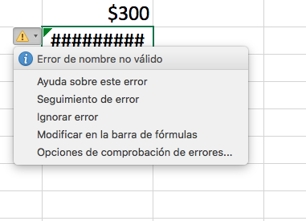

Aun así, hay situaciones en las que todavía no puedes averiguar qué salió mal con tu hoja de cálculo para resolver este error. Para esos casos, te proporcionamos la siguiente lista de errores comunes, explicaciones y consejos para superarlos. Busca el contexto que necesitas para corregir tus errores y vuélvete todo un experto en Excel.

### "#¡VALOR!"

Excel muestra el error de #¡VALOR! cuando encuentra espacios, caracteres o texto en una fórmula donde espera un número.

Excel requiere que las fórmulas contengan solo números, por lo que te mostrará un error si has incluido algo más.

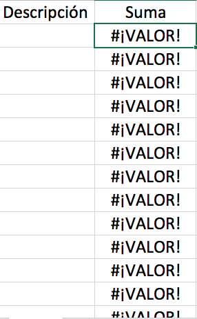

**Cómo resolver este error**:

Una solución fácil es verificar tu fórmula para asegurarte de que solo utilizaste números. Si sigues viendo un error, busca celdas en blanco, fórmulas faltantes que enlacen con celdas o cualquier carácter especial que puedas estar usando.

En el ejemplo anterior, la columna «Suma» se refiere a celdas vacías. Excel no puede calcular la suma de columnas vacías, por lo que nos da un error.

### "#¿NOMBRE?"
  
Este es un error de Excel un poco más complejo. Aquí hay un resumen de por qué esto podría aparecer en una celda en la que estás trabajando:

> :cookie: **¿Por qué obtengo el error #¿NOMBRE? en Excel?**
>
> Este mensaje aparece como un error si Excel no puede entender el nombre de la fórmula que estás intentando ejecutar, o si no puede calcular uno o más valores ingresados ​​en la fórmula. Para resolver este error, verifica la ortografía de la fórmula o usa el Generador de fórmulas para que Excel haga la función por ti.

El error `#¿NOMBRE?` aparece en una celda cuando Excel no puede leer ciertos elementos de una fórmula que estás intentando ejecutar.

Por ejemplo, si tratas de realizar la fórmula `=BUSCARV()` y la escribes incorrectamente, Excel te mostrará el error `#¿NOMBRE?` después de ingresar los valores y presionar Enter. Comprueba este error a continuación: como puedes notar, a la celda le falta la «V» en «= BUSCARV».

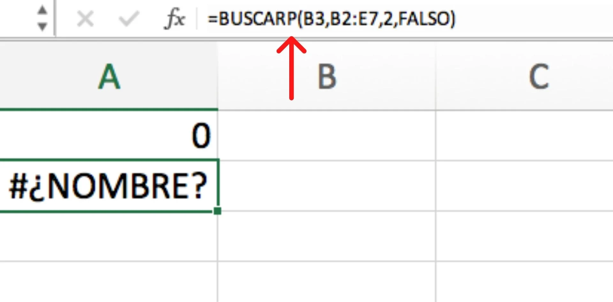

También puedes haber escrito la fórmula correctamente, pero no ingresaste suficiente información en las entradas individuales de la fórmula. Comprueba cómo se vería este error: como puedes notar, la entrada de la matriz de la tabla está incompleta. Necesita un nombre de hoja de cálculo real para saber dónde buscar nuestro valor deseado.

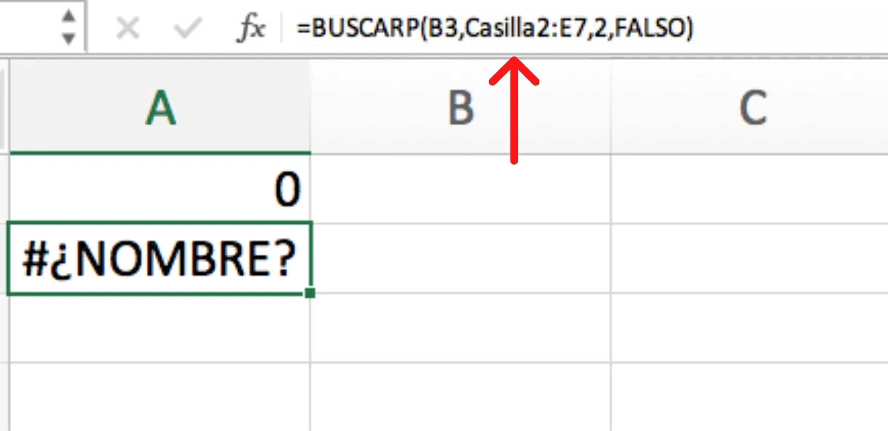

**Cómo resolver este error**:

¿Para arreglar el error #¿NOMBRE? en Excel verifica la ortografía de la fórmula que estás intentando ejecutar.

Si la fórmula está escrita correctamente y tu hoja de cálculo aún muestra un error, es probable que Excel se esté confundiendo con una de tus entradas dentro de la fórmula.

Una forma fácil de solucionar este problema es hacer que Excel inserte la fórmula por ti. Resalta la celda en la que deseas ejecutar una fórmula, luego haz clic en la pestaña «Fórmulas» en la barra de navegación superior. Selecciona «Insertar función» (si estás utilizando Microsoft Excel 2017, esta opción estará en el extremo izquierdo de la barra de navegación de fórmulas).

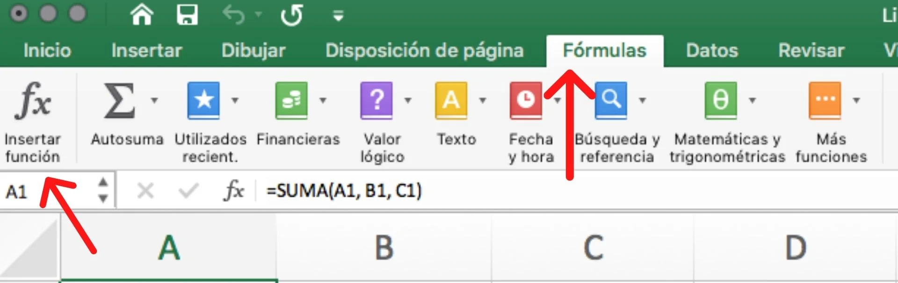

Una vez que selecciones «Insertar función», aparecerá un generador de fórmulas en el lado derecho de tu hoja de cálculo, donde podrás seleccionar la fórmula deseada. Luego, Excel te guiará a través de cada paso de la fórmula en campos separados, para garantizar que no se cometan errores y que el programa pueda leer tu celda correctamente.

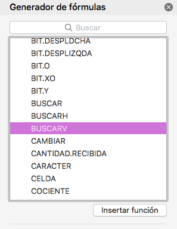

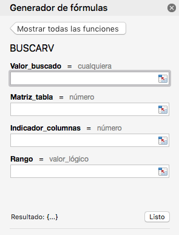

### "Error #####"

Cuando ves `#####` en tu celda puede parecer un poco aterrador. La buena noticia es que esto simplemente significa que la columna no es lo suficientemente ancha para mostrar el valor que ingresaste. Y tiene una solución fácil.

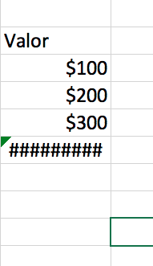

**Cómo resolver este error**:

Haz clic en el borde derecho del encabezado de la columna y aumenta el ancho de la columna.

> :tiger: **Consejo profesional**: puedes hacer doble clic en el borde derecho del encabezado para ajustar automáticamente la celda más ancha en esa columna.

### "#¡DIV/0!"

Cuando ves `#¡DIV/0!`, le estás pidiendo a Excel que divida una fórmula por cero o una celda vacía; piensa en que esta misma tarea no funcionaría si estuvieras haciendo una división a mano o en una calculadora.

**Cómo resolver este error**:

Este error es bastante fácil de resolver. Simplemente cambia el valor de la celda a un valor que no sea igual a 0, o agrega un valor si tu celda estaba en blanco. He aquí un ejemplo:

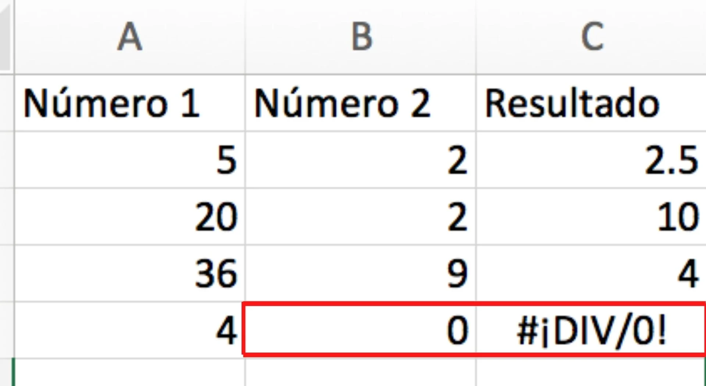

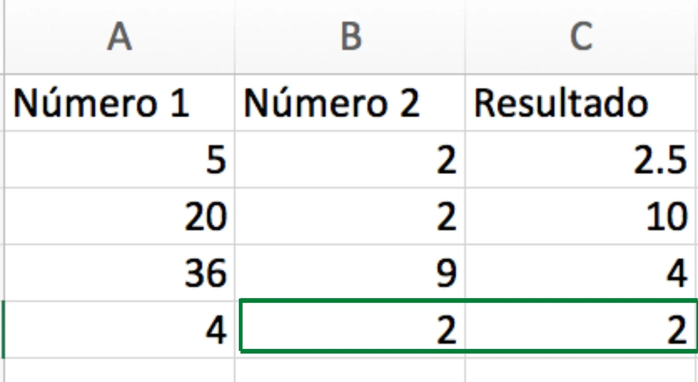

En algunos casos, puedes encontrar que simplemente está esperando una entrada en una celda en particular. En lugar de incluir un «0» como marcador de posición puedes agregar un mensaje de visualización personalizado.

### "#¡REF!"

Este error a veces puede ser un poco complicado de entender, pero Excel generalmente muestra #¡REF! cuando una fórmula hace referencia a una celda que no es válida. A continuación, te mostramos un resumen de la procedencia de este error:

> :cookie: **¿Cuál es el error #¡REF! en Excel?**
>
>Aparece un error en Excel si estás ejecutando una fórmula que se refiere a una celda que no existe. Si eliminas una celda, columna o fila en tu hoja de cálculo y creas una fórmula que incluye un nombre de celda que se ha eliminado, Excel devolverá el #¡REF! error en la celda que contiene la fórmula.

Ahora bien, ¿qué significa realmente este error? Pudiste haber eliminado o pegado accidentalmente una celda que se usó en tu fórmula. Por ejemplo, digamos que la columna «Resultado» hace referencia a la fórmula: `=SUMA(A2, B2, C2)`.

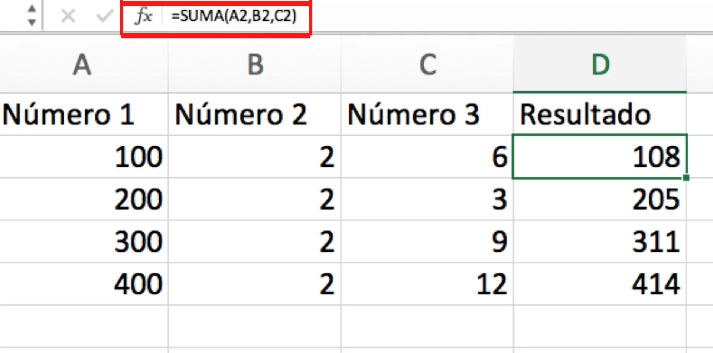

Si elimináramos accidentalmente la columna «Número 2», veríamos este error:

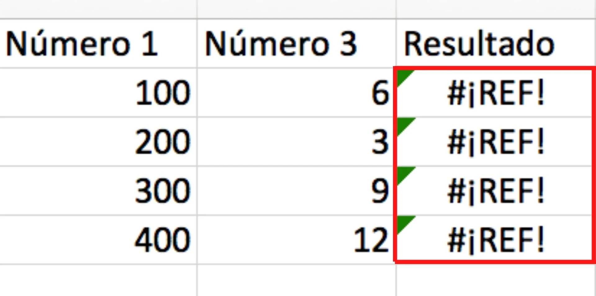

**Cómo resolver este error**:

Antes de pegar sobre un conjunto de celdas, asegúrate de que no haya fórmulas que se refieran (por lo tanto, «REF») a las celdas que estás eliminando. Además, al borrar celdas, es importante verificar dos veces qué fórmulas se refieren a esas celdas.

Consejo profesional: si eliminas accidentalmente algunas celdas, puedes hacer clic en el botón Deshacer en la barra de herramientas de acceso rápido (o presionar `CTRL + Z` para PC / `Comando + Z` para Mac) para restaurarlas.

### "#¡NULO!"

Estos errores ocurren cuando especificas una intersección de dos áreas que en realidad no se cruzan, o cuando se usa un operador de rango incorrecto.

Para darte un contexto adicional, así es como funcionan los operadores de referencia de Excel:

- **Operador de rango (punto y coma)**: define referencias a un rango de celdas.
- **Operador de unión (coma)**: combina dos referencias en una única referencia.
- **Operador de intersección (espacio)**: devuelve una referencia a la intersección de dos rangos.

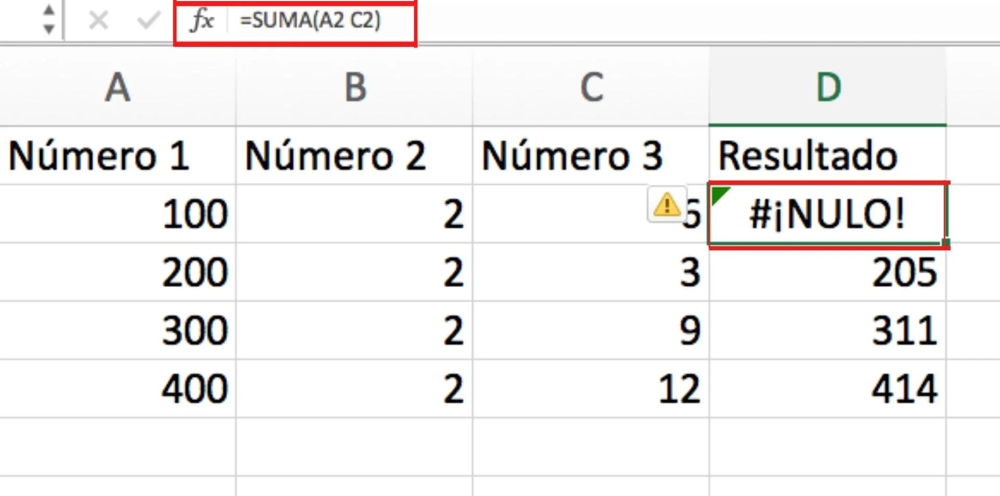

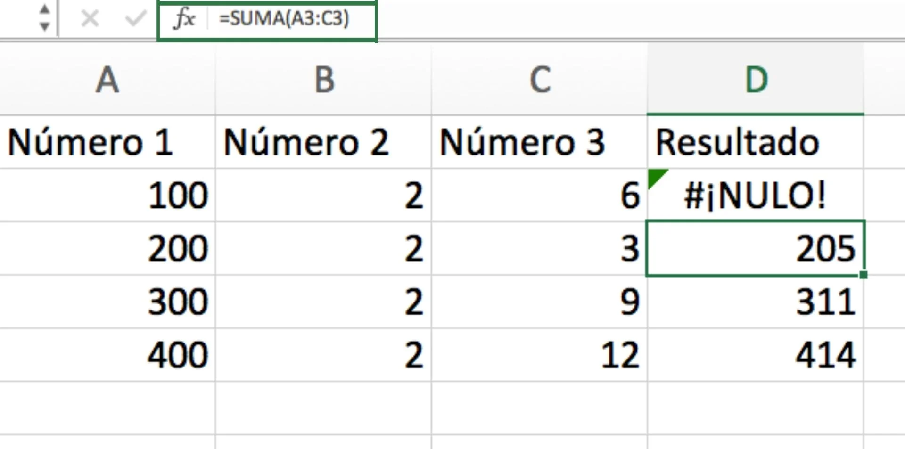

**Cómo resolver este error**:
Lo primero que debes hacer es verificar que estés usando la sintaxis correcta en tu fórmula.

Debes usar dos puntos para separar la primera celda de la última celda cuando te refieres a un rango continuo de celdas en una fórmula. Por otro lado, tienes que usar una coma cuando te refieras a dos celdas que no se cruzan.

### "#N/A"

Cuando ves #N/A, esto generalmente significa que los números a los que te refieres en tu fórmula no se pueden encontrar.

Es posible que hayas eliminado accidentalmente un número o una fila que se está utilizando en tu fórmula o te estás refiriendo a una hoja que se eliminó o no se guardó.

Para los usuarios avanzados, una de las causas más comunes del error #N/A es cuando no se puede encontrar una celda en una fórmula a la que se hace referencia en BUSCARV.

**Cómo resolver este error**:

Verifica varias veces todas tus fórmulas y asegúrate de mirar de cerca qué hojas o filas pudieron haberse eliminado o haber sido referenciadas incorrectamente. Si tienes algunas fórmulas vinculadas, comprueba que todo en cada fórmula tenga un valor.

### "#¡NUM!"

Si tu fórmula contiene valores numéricos que no son válidos, verás un error #¡NUM! en Excel. A menudo, esto sucede cuando ingresas un valor numérico que es diferente a los otros argumentos utilizados en tu fórmula.

Por ejemplo, cuando ingreses una fórmula de Excel, verifica que no estés incluyendo valores como $ 1.000 en formato de moneda. En su lugar, ingresa 1000 y luego formatea la celda con moneda y comas después de calcular la fórmula.

**Cómo resolver este error**:

Verifica si has ingresado alguna moneda, fechas o símbolos especiales formateados. Luego, asegúrate de eliminar esos caracteres de la fórmula conservando solo los números.

A continuación, te mostramos cómo puedes formatear números después de eliminar las comas y la moneda de tu fórmula:

Selecciona toda la columna con las cantidades que deseas formatear.

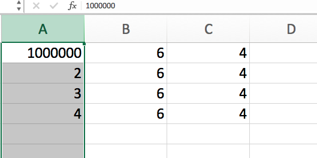

Después dirígete a tu barra de tareas y busca el icono con el signo de «$» y selecciona el tipo de moneda según tu región.

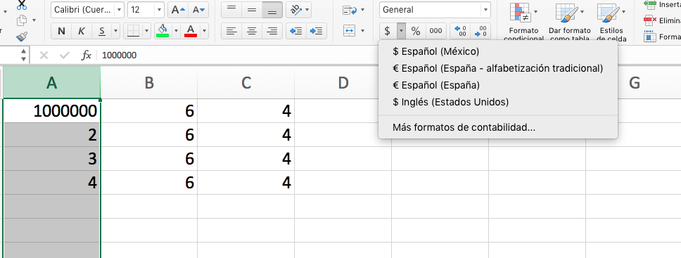

De inmediato podrás ver las cantidades ya formateadas como lo indicaste.

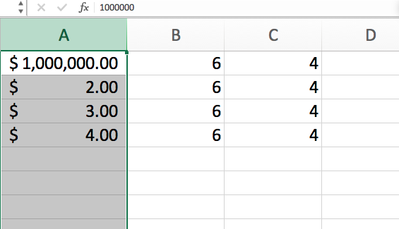

### Resumen

|Error|Comentario|
|-|-|
|`#######`|El nombre no es válido o el contenido supera el tamaño de la celda|
|`#¡NULO!`|No existe una celda de intersección|
|`#¡DIV/0!`|El divisor no puede ser cero|
|`#¡VALOR!`|La fórmula contiene tipos de argumentos no válidos|
|`#¡REF!`|Referencia inválida|
|`#¿NOMBRE?`|Nombre de la función o del rango desconocido|
|`#¡NUM!`|No es un número válido|
|`#¡N/A!`|Faltan datos|

## Actividad de clase

