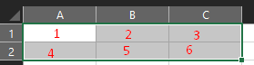
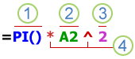

# Guía 3er Parcial (El más perri)

## Índice

- [Guía 3er Parcial (El más perri)](#guía-3er-parcial-el-más-perri)
  - [Índice](#índice)
  - [Unidad 1](#unidad-1)
    - [Problema](#problema)
    - [Algoritmos](#algoritmos)
      - [Características de los algoritmos](#características-de-los-algoritmos)
  - [Unidad 2](#unidad-2)
    - [Rangos de celdas](#rangos-de-celdas)
    - [Top funciones más usadas](#top-funciones-más-usadas)
    - [Resumen de Errores en Excel](#resumen-de-errores-en-excel)
    - [Las partes de una fórmula de Excel](#las-partes-de-una-fórmula-de-excel)
  - [Unidad 3](#unidad-3)
    - [Qué es y para qué usar una base de datos](#qué-es-y-para-qué-usar-una-base-de-datos)
      - [Elementos de la base de Datos](#elementos-de-la-base-de-datos)
    - [Formularios](#formularios)
      - [¿QUÉ ES UN FORMULARIO EN EXCEL?](#qué-es-un-formulario-en-excel)
      - [TIPOS DE FORMULARIOS EN EXCEL](#tipos-de-formularios-en-excel)

## Unidad 1

### Problema

La Real Academia de la Lengua Española define: "Problema" como "Conjunto de hechos o circunstancias que dificultan la consecución de algún fin" mientras que Wikipedia lo define como: "Un asunto del que se espera una solución”; entonces tenemos, que un problema puede definirse como una situación, con un grado de dificultad variable, que debe aclararse o resolverse y que puede tener un número determinado o indefinido de soluciones.
Muchos de los problemas pueden resolverse con intervención de la computadora (entendiéndose como tal una tablet, laptop, smartphone, equipo de escritorio o dispositivo similar); por ejemplo: editar un video, elaborar una gráfica, saber el estado del tráfico de la ciudad o enviar un documento importante a otra persona. Pero hay otros en los que, debido a sus características, la máquina, definitivamente, no puede ayudarte en la solución.

### Algoritmos

Se denomina algoritmo a un conjunto finito de instrucciones o pasos, ordenados de manera lógica, que permiten solucionar un determinado problema.
Esta palabra proviene del nombre del matemático y astrónomo árabe Al-Khwarizmi quien vivió en Bagdad entre los siglos VII y VIII y quien también es considerado el Padre del álgebra.
Los algoritmos están relacionados con la Metodología de Solución de Problemas, debido a que nos ayudan a plantearnos diferentes alternativas para resolverlos, así como elegir y desarrollar la más adecuada de ellas. Es por ello que un algoritmo es la técnica más importante para la resolución de problemas.

#### Características de los algoritmos

- **Finito**: Debe tener un número determinado de pasos, un inicio y un final.
- **Legible**: El texto que lo describe debe ser claro, tal que permita entenderlo y leerlo fácilmente.
- **Preciso**: Cada paso debe estar muy claro, ser breve y concreto, evitando ambigüedades.
- **Eficaz**: El algoritmo debe resolver el problema.
- **Eficiente**: Debe resolver el problema utilizando de forma óptima los recursos disponibles.
- **Definido**: Si se sigue un algoritmo dos o más veces, se debe obtener el mismo resultado cada vez que se aplica en problemas del mismo tipo.
Diagramas de flujo
Es la representación gráfica de un algoritmo. Para su construcción se usan símbolos estandarizados en el que cada uno tiene un significado. Los pasos del algoritmo se escriben dentro del símbolo correspondiente y se unen por flechas, denominadas "líneas de flujo”, que indican el orden en que los pasos deben de llevarse a cabo.

## Unidad 2

### Rangos de celdas

Un rango en Excel es un conjunto de celdas contiguas que se pueden seleccionar para realizar una operación con todas ellas. Además, **su dirección está dada por la celda superior izquierda seguido de dos puntos y la celda inferior derecha**.

Por ejemplo, podemos decir que el rango `A1:C2` está conformado por las celdas `A1`, `B1`, `C1`, `A2`, `B2` y `C2`. A la hora de interpretarlo podemos hacer referencia a las celdas que van desde `A1` hasta la `C2` que abarcan `6` celdas en total.

Además, un rango de celdas puede estar compuesto por una sola celda o "X" cantidad de celdas, lo que quiere decir esto, es que una celda por sí misma ya representa un rango en Excel.

### Top funciones más usadas

A Continuación se muestran las funciones más utilizadas en Microsoft Excel:

|Fórmula|Descripción|Ejemplo de estructura|
|-|-|-|
|`=SUMA()`|Esta es una fórmula elemental que no puedes no conocer. Si no la has usado hasta ahora creo que ya puedes darte por satisfecho porque verás cómo te ahorra tiempo.  SUMA te permite, tal como su nombre lo indica, sumar un grupo de celdas, o incluso filas y columnas enteras!|`=SUMA(A1:A10)`, `=SUMA(A:A)`, `=SUMA(A1:Z10)`|
|`=CONTAR()`|Esta fórmula te permite contar la cantidad de celdas en una selección que tienen números. Las celdas vacías o con texto son ignoradas. Muchas veces tenemos planillas con datos incompletos y se necesita contar solamente los datos y no el total de celdas. En esos casos sirve muchísimo!|`=CONTAR(A1:B10)`, `=CONTAR(A:A)`|
|`=CONTARA()`|Similar a CONTAR pero cuenta no solamente las celdas con números sino todas las celdas no vacías (es decir, pueden contener también texto).|`=CONTARA()`|
|`=CONTAR.SI()`|Esta fórmula permite contar elementos que cumplen un cierto criterio. Este criterio puede ser por ejemplo que las celdas sean iguales a un cierto valor, o que sean mayor/menos que un valor, o que sean iguales que algún texto, etc. Veamos algunos ejemplos:|Cuenta la cantidad de celdas con un número mayor que cero: `=CONTAR.SI("A1:B10", ">0")` Cuenta la cantidad de celdas con la palabra "azul": `=CONTAR.SI("A1:B10", "azul")`|
|`=SI()`|Esta fórmula te permite tener un valor u otro en la celda dependiendo de una cierta condición. Las condiciones son similares a lo que se puede hacer con la fórmula CONTAR.SI. Por ejemplo, podemos tener las notas de un alumno en un listado, y si el promedio es mayor o menor que un cierto límite, podemos escribir "aprobado" o "reprobado" para el alumno:|`=SI(A1 > 0, "VALOR POSITIVO", "VALOR NEGATIVO")`|
|`=BUSCARV()`|Permite buscar un valor específico en la primera columna de una tabla, y retornar el valor en la misma fila para otra columna diferente. Esto suena algo abstracto así que lo voy a ilustrar con un ejemplo. Tenemos un listado con alumnos y sus notas en cada evaluación. Queremos obtener la nota que el alumno "PEDRO" obtuvo en la tercera evaluación, entonces utilizamos la siguiente fórmula:|`=BUSCARV("PEDRO", A1:Z100, 10, FALSO)` _Notar que el "FALSO" se ingresa para indicar que queremos una búsqueda exacta, es decir sólo queremos el valor para la entrada con índice PEDRO. Notas también que la primera columna que se cuenta es la primera, por eso la que buscamos (la tercera evaluación) es la columna número 4._
|`=BUSCARH()`|Similar a BUSCARV pero utilizando la misma analogía en sentido horizontal. Es decir buscamos un valor en la primera celda de la tabla, y luego obtenemos el valor de la celda ubicada en la misma columna que nuestro índice, con el número de fila ingresado: Ejemplo, tenemos las ventas de distintos productos, y queremos saber el total que se vendió para el producto "jabón" en el cuarto mes:|`=BUSCARH("JABON", A1:C10, 4, FALSO)` _El uso de "FALSO" es igual al caso anterior. La cuenta de las filas parte desde la fila con los encabezados, por lo que el tercer mes corresponde al índice 4._
|`=SUMAR.SI()`, `=PROMEDIO.SI()`|Estas funciones nos permiten realizar una suma o un promedio solamente para los valore que cumplen una condición. Las condiciones que se pueden ingresar siguen el mismo formato que las condiciones utilizadas en CONTAR.SI y el SI.|`=SUMAR.SI(A1:Z1, ">0")`|
|`=CONCATENAR()`|Esta fórmula nos permite unir dos o más cadenas de texto en una sola celda. Por ejemplo tenemos una columna "nombres" y otra "apellidos", y queremos crear una tercera columna llamada "nombre completo". En este caso queremos unir el nombre con el apellido, y además poner un espacio entremedio. Se haría de la siguiente manera:|`=CONCATENAR("A1", " ", "B1")`|
|`=ALEATORIO.ENTRE()`|Muchas veces se necesita llenar una tabla con números distintos de manera rápida, solamente para mostrar algo y nos pasamos un buen rato escribiendo número uno a uno y tratando de que sean distintos entre sí. Bueno, ALEATORIO.ENTRE nos permitegenerar un número aleatorio en un rango que nosotros especificamos:|`=ALEATORIO.ENTRE(100, 1000)`|

### Resumen de Errores en Excel

|Error|Comentario|
|-|-|
|`#######`|El nombre no es válido o el contenido supera el tamaño de la celda|
|`#¡NULO!`|No existe una celda de intersección|
|`#¡DIV/0!`|El divisor no puede ser cero|
|`#¡VALOR!`|La fórmula contiene tipos de argumentos no válidos|
|`#¡REF!`|Referencia inválida|
|`#¿NOMBRE?`|Nombre de la función o del rango desconocido|
|`#¡NUM!`|No es un número válido|
|`#¡N/A!`|Faltan datos|

### Las partes de una fórmula de Excel

Una fórmula también puede contener algunos o todos los elementos siguientes: funciones, referencias, operadores y constantes.

Partes de una fórmula

1. **Funciones**: la función `PI()` devuelve el valor de $Pi: 3,142...$.

2. **Referencias**: `A2` devuelve el valor de la calda A2.

3. **Constantes**: números o valores de texto escritos directamente en una fórmula como, por ejemplo, $2$.

4. **Operadores**: el operador `^` (acento circunflejo) eleva un número a una potencia y el operador `*` (asterisco) multiplica números.

## Unidad 3

### Qué es y para qué usar una base de datos

La base de datos en Excel, es una herramienta que podemos utilizar para gestionar la información, mantenerla ordenada y estructurada, con el fin de que podamos encontrar los datos de manera fácil, y además, podemos adaptarlas a nuestros objetivos y necesidades.

Por ejemplo, puedes usar una base de datos para registrar la asistencia en clase de tus alumnos, en el caso de que tu profesión sea la de enseñar. Puedes tener una base de datos personal con funciones que te permitan almacenar contactos, teléfonos, email, etc.

#### Elementos de la base de Datos

Antes de ver cómo crear una base de datos en Excel, analicemos primero, cuáles serían esos posibles elementos que no deberían faltar en nuestra base de datos y empecemos por el elemento principal, el cual le dará forma a la base de datos.

**Las tablas**. Este formato podemos aplicarlo a un determinado rango de celdas con el fin de que tengan relación entre sí. Recordemos que una tabla tiene dos componentes, las columnas y las filas. En las columnas podemos colocar el tipo de información que se desea gestionar y en las filas introducir los registros individuales, es decir la información.

**El identificador o llave primaria**. Tener un identificador único en cada fila, un número de serie, el número de identificación o un código, son opciones que se pueden considerar para organizar nuestra base de datos.

**Columnas/Atributos**. Las columnas almacenan información de diversos tipos, como números, nombres y fechas.

**Filas/Registros/Tuplas**. Un registro o fila almacena una sección individual de información. Por ejemplo, una tabla de «empleados» puede tener filas que contenga información específica sobre los diferentes empleados.

### Formularios

Los formularios en Excel son un método para ingresar datos a nuestras hojas y son de mucha utilidad porque nos ayudan a evitar errores en la captura de información. Podemos comparar los  formularios de Excel con los formularios impresos en papel.

#### ¿QUÉ ES UN FORMULARIO EN EXCEL?

Seguramente has llenado un formulario en papel, tal vez cuando has acudido a alguna oficina de gobierno para realizar un trámite, así que sabes de lo que estoy hablando. Estos formularios contienen instrucciones precisas de lo que debes escribir  y contienen los recuadros necesarios para ingresar los datos.

Los formularios en Excel no son tan diferentes de los formularios impresos ya que de igual manera proveen de los espacios necesarios para ingresar los datos. Los formularios en Excel utilizan objetos especiales conocidos como controles de formulario que son precisamente los que nos permiten agregar campos de texto, listas, botones de opción entre otras cosas más.

#### TIPOS DE FORMULARIOS EN EXCEL

Cuando hablamos de formularios en Excel, es necesario recordar que podemos crear tres tipos diferentes de formularios:

- Formulario de datos.
- Hojas de cálculo con controles de formulario o controles ActiveX.
- Formularios de usuario en VBA.

